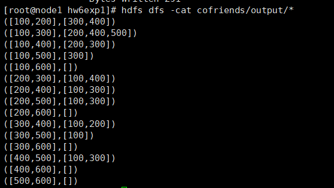

# 作业6  

## CoFriends 1.0  

### CoFriends1: 思路  
作业6的要求是要找出任意两个person的共同好友。输入的格式是：  
personx friend1,friend2,...  
这个格式可以看作：  
friendx person1,person2,...  
即每一行的第一个用户person可以看成是后面一串用户friend1,friend2,...的共同好友。那么map阶段产生key的思路就有了，就是遍历每一行person后的friends串，生产一个由两个不相同的friend组成的key: [personi,personj]。value就是每一行的第一个用户person。在reduce阶段对相同key的value值合并，产生[friend1,friend2,...]。最后按照输出格式的要求进行调整即可。  

### CoFriends1: Mapper
对每一行数据，首先获得第一个用户编号，作为value值。  
```java
StringTokenizer itr = new StringTokenizer(line);
//第一个用户编号作为后面用户的共同好友，设为value值
String aFriend=itr.nextToken();
```  
然后将后面的用户按顺序加入到一个list中，对这个list进行两重循环，遍历所有不相同的两两用户组合，产生key值"[Personi,Personj]"，以Text的形式输出。
```java  
//做两重循环，对任意两个不相同的用户，产生key值[Ui,Uj]
int size=persons.size();
for (int i=0;i<size;i++) {
    for (int j=i+1;j<size;j++) {
        String p_touple="["+persons.get(i)+","+persons.get(j)+"]";
        context.write(new Text(p_touple),new Text(aFriend));
    }
}
```  
这里还有一个小细节需要注意，如果存在两个用户之间没有共同好友，那就不会产生这两个用户组合的key。最后的输出里也不会看到这两个用户共同好友的结果，即使他们没有共同好友。我认为还是有必要把这种情况输出的。那怎么解决这个问题呢？我的办法是，在CoFriends1中设置了一个静态的全部list——visited，用来记住所有用户。每调用依次map方法时，都将第一个用户编号写入visited，这样就保证了visited最后是储存的所有用户编号。  
最后，由于Mapper类会在所有map结束之后被调用一次cleanup方法，所以可以重写cleanup方法。对储存所有用户的列表进行两重循环，生成Text类型的key:"[Personi,Personj]"，而value的值是一个无意义的符号（我用的是"*"），代表任意两个用户之间都有一个共同的空好友。然后在reduce阶段的value字符串中删除这个无意义的符号就好了。  
cleanup方法：  
```java  
@Override
protected void cleanup(Context context
                    ) throws IOException, InterruptedException {
    //为了解决没有共同好友的用户组不输出的问题，在所有map结束之后
    //对任意两个不相同的用户产生一个<"[Ui,Uj]","*">的key-value对
    int size=visited.size();
    for (int i=0;i<size;i++) {
        for (int j=i+1;j<size;j++) {
            String p_touple="["+visited.get(i)+","+visited.get(j)+"]";
            context.write(new Text(p_touple),new Text("*"));
        }
    }
}
```  

### CoFriends1: Reducer  
reducer要做的事情就很简单了，只需要把相同key的value做一个简单的字符串拼接。为了输出的美观和一致性，我先把value值存放到TreeSet中，最后输出的公共好友列表是按顺序排列的，方便检查。还不要忘记删去map最后产生的无意义的value。  
```java  
//先将所有value存到一个TreeSet中，为了让输出的共同好友是按顺序排列的。
TreeSet<String> cofriends= new TreeSet<String>();
for (Text val:values) {
    cofriends.add(val.toString());
}
//还不要忘了删去Mapper的cleanup阶段产生的无意义value
cofriends.remove("*");
//拼接value字符串，将字符串转为特定的输出格式。
String valuetuple="["+StringUtils.join(",", cofriends)+"]";
String keyform="("+key.toString();
String valueform=valuetuple+")";
context.write(new Text(keyform),new Text(valueform));
```  

### CoFriends1: 运行和输出  
可执行的jar包名称为CoFriends-1.0-SNAPSHOT（在target文件夹中）。调用的模块为com.hw6.CoFriends1。需指定输入和输出路径。在我的集群上运行的完整命令为：  
hadoop jar CoFriends-1.0-SNAPSHOT.jar com.hw6.CoFriends1 cofriends/input cofriends/output  
输出的文件放在了output/result1中。输出结果：  
```
([100,200],[300,400])
([100,300],[200,400,500])
([100,400],[200,300])
([100,500],[300])
([100,600],[])
([200,300],[100,400])
([200,400],[100,300])
([200,500],[100,300])
([200,600],[])
([300,400],[100,200])
([300,500],[100])
([300,600],[])
([400,500],[100,300])
([400,600],[])
([500,600],[])
```  
### CoFriends1: 运行截图  




## CoFriends 2.0
CoFriends1的输出和实际情况是有一定的出入的。比如400和600显然是有一个共同好友100。但是这里并没有输出。原因是什么呢？仔细查看输入发现，CoFriends1必须是在好友关系是双向的情况下才能保证完全正确，即100如果是600的好友，就一定有600是100的好友。但是作业的输入文件中，100是600的好友，而600却没有出现在100的好友列表中。不知道是漏了还是允许单向的好友关系。在不改变输入的情况下，我打算对算法进行扩展，使得它能处理单向的好友关系。问题就可以理解为，找出任意两个用户共同关注的其他用户。  

### CoFriends2: 思路  
由于考虑的单向的好友关系，输入的形式应该这样看：  
p1,f11 f12 f13...  
p2,f21 f22 f23...  
目标是找出pi和pj的共同好友f。为此，我打算设计两个MapReduce任务，第一个job的输出结果key是一个被关注的friend，value是关注他的所有用户列表[p1,p2,...],即<fi,[p1 p2 p3....]>。第二个MapReduce的任务就和CoFriends1的任务一样，输入是上一个job的输出，Map阶段对每个friend对应的用户列表生成tuple形式的key，value就是friend编号，然后在Redue阶段进行整合。  
因此，对于CoFriends2，只需要多设计第一个阶段的mapper和reducer。  

### CoFriend2: TokenizerMapper  
按照每个用户的好友列表进行切分，将某个好友设为key，当前用户设为value
```java 
person.set(aPerson);
//为了解决没有共同好友的用户不输出的问题，假设每一个用户都关注一个空好友。
friend.set("*");
context.write(friend, person);
//按好友列表切分，key为某个好友friendx，value为当前用户person
while (itr.hasMoreTokens()) {
friend.set(itr.nextToken());
context.write(friend, person);
}
```  

### CoFriend2: SumReducer  
对于每个key，即被关注的friend，将关注该friend的所有用户进行整合，形成Text形式的用户列表，作为value值。
```java  
TreeSet<String> persons= new TreeSet<String>();
//将关注同一个friend的person合成一个string
for (Text val:values) {
persons.add(val.toString());
}
context.write(key, new Text(StringUtils.join(",", persons)));
```  

### CoFriend2: CombineMapper和CombineReducer  
CombineMapper和CombineReducer是第二个job的mapper和reducer，逻辑和CoFriend1相同，这里就不赘述了。  
由于设计了两个MapReduce job，第一个job的结果以SequenceFileOutputFormat的形式输出到临时文件中，第二个job从该临时文件读入，然后执行MapReduce，所以CombineMapper的key-value输入类型就可以直接设为<Text,Text>。

### CoFriends1: 运行和输出
可执行的jar包名称为CoFriends-1.0-SNAPSHOT（在target文件夹中）。调用的模块为com.hw6.CoFriends2。需指定输入和输出路径。在我的集群上运行的完整命令为：  
hadoop jar CoFriends-1.0-SNAPSHOT.jar com.hw6.CoFriends2 cofriends/input cofriends/output  
输出的文件放在了output/result2中。输出结果：  
```  
([100,200],[300,400])
([100,300],[200,400,500])
([100,400],[200,300])
([100,500],[300])
([100,600],[])
([200,300],[100,400])
([200,400],[100,300])
([200,500],[100,300])
([200,600],[100])
([300,400],[100,200])
([300,500],[100])
([300,600],[100])
([400,500],[100,300])
([400,600],[100])
([500,600],[100])
```  

### CoFriends2: 运行截图  


  

## 小结  
CoFriend1模块完成了默认好友关系是双向的条件下寻找共同好友的任务。由于输入文件中出现了单向的好友关系，设计了CoFriend2让输出变得更加正确。除了对Mapper和Rducer的设计之外，还有很多细节值得考虑，比如如果两个用户没有共同好友如何输出空的结果，以及怎么保证"[Ui,Uj]"和"[Uj,Ui]"是同一个key等问题。下面还将指出一些解决方案中的不足：  
### (1) CoFriends1中没有保证key的一致性  
这里所谓的一致性就指的是key"[Ui,Uj]"和"[Uj,Ui]"是等价的。CoFriends1中并没有做这个保证。因为输入的每一行好友列表都是按顺序排列的，因此生成的key"[Ui,Uj]"中，Ui小于等于Uj，这样让key都默认形式是一致的了。但如果好友列表是乱序的，那结果就很难保证了。CoFriends2中就不存在这个问题，因为第一次MapReduce中，reducer先将所有value值存进了一个TreeSet中，这就保证了所有的列表都是按顺序排列的，第二次Mapper生成的key也就自动遵循了Ui小于等于Uj这一规则。要想解决这个问题也很简单，也将好友列表的元素都存入一个TreeSet中然后再生成key即可。  
### (2) 可以使用自定义的数据类型  
CoFriends1和CoFriends2中，用户列表都是以Text的形式传递的，需要进行很多字符串的操作。可以自己定义一个WritableComparable的用户列表数据类型，存储一系列用户编号。需要实现write方法：输出用户列表；readFields方法：存入用户列表；compareTo方法：比较两个列表（其实没有比较过程）关于自定义数据类型，之后会尝试实现一下。